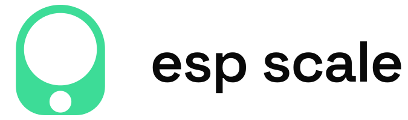
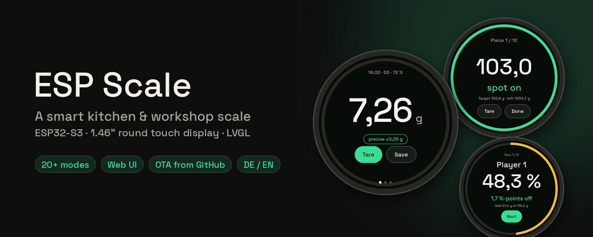
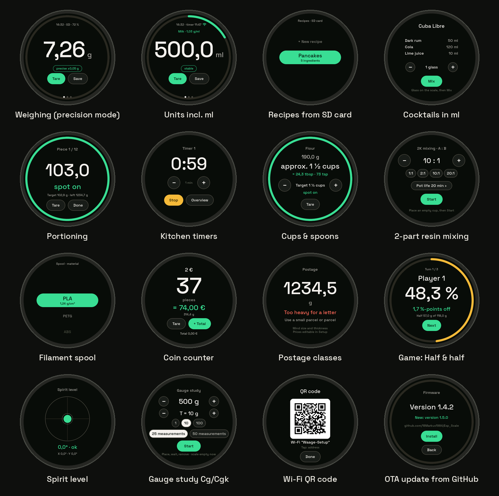
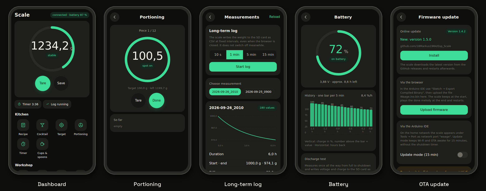
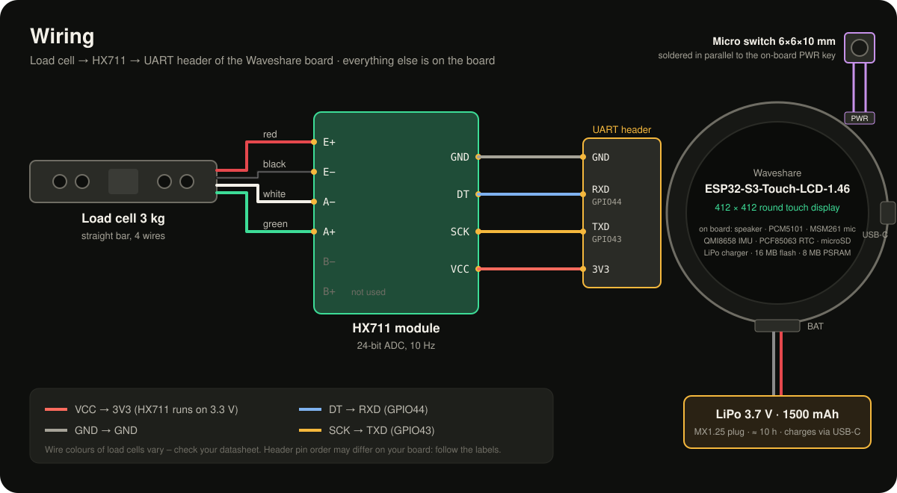
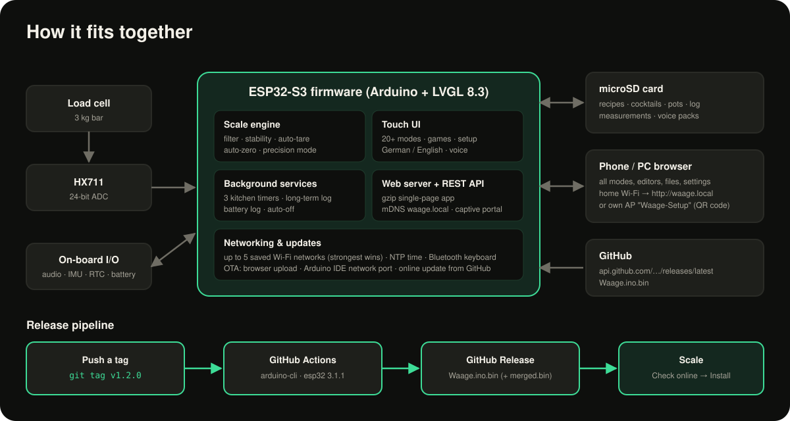

<p align="center">
  <picture>
    <source media="(prefers-color-scheme: dark)" srcset="docs/images/logo-wordmark-dark.svg">
    
  </picture>
</p>

<p align="center">
  
</p>

<p align="center">
  <a href="https://github.com/18Markus1984/Esp_Scale/actions/workflows/firmware.yml"></a>
  <a href="https://github.com/18Markus1984/Esp_Scale/releases/latest"></a>
  
  
  
</p>

# ESP Scale

**ESP Scale** turns a 3 kg load cell and a Waveshare **ESP32-S3 board with a 1.46″ round touch display**
into a kitchen and workshop scale that does a lot more than show grams. It walks you through recipes
and cocktails, splits dough into equal portions, mixes 2-part resin by ratio, counts screws and coins,
logs weight over hours and runs party games. Everything can also be used from your phone. The web
interface is served by the scale itself. New firmware is built by GitHub Actions and installed
**over the air, straight from this repository's releases**.

The whole UI is available in **English and German** (display, web interface and voice output).

---

## Contents

- [Highlights](#highlights)
- [Screens](#screens)
- [Web interface](#web-interface)
- [Hardware](#hardware)
- [Wiring](#wiring)
- [How it fits together](#how-it-fits-together)
- [Getting started](#getting-started)
- [Firmware updates](#firmware-updates)
- [SD card](#sd-card)
- [Repository layout](#repository-layout)
- [Credits and licenses](#credits-and-licenses)

---

## Highlights

| | |
|---|---|
| ⚖️ **Precise weighing** | 0.1 g resolution, stability detection, **precision mode** (averaging, two decimals), **auto-zero** drift tracking, multi-point calibration, units g / kg / oz / lb / **ml** (12 liquids with density). |
| 🍲 **Pot detection** | Place an empty pot you have saved before and it is tared automatically after a short countdown. |
| 🧭 **20+ modes** | Grouped into *Kitchen*, *Workshop* and *Games*, each with guided steps, a progress ring and a "parking sensor" beeper that gets faster as you approach the target. |
| 📱 **Built-in web app** | Every mode, recipe and cocktail editor, log, battery chart, SD file manager and all settings in the browser: `http://waage.local`. |
| ☁️ **OTA from GitHub** | Push a tag and GitHub Actions compiles the firmware. The scale finds the release and installs it with one tap. |
| 📶 **Wi-Fi made easy** | Up to 5 saved networks (the strongest one wins), a setup access point with QR code, NTP time sync. |
| 🔊 **Sound and voice** | Sound schemes, spoken weights and character lines from WAV voice packs (German and English), a speaker button to stop or switch announcements, experimental offline voice commands (ESP-SR). |
| 🔋 **Battery aware** | LiPo runtime ≈ 10 h, calibrated charge curve, history chart, discharge test, auto-off, deep-discharge protection. |
| 🧪 **Quality tools** | Periodic **check weight** reminder with pass/fail history, gauge capability study (Cg / Cgk, "type 1 study") with CSV export, spirit level from the IMU, long-term CSV logging with trend. |

### Modes

| Kitchen | Workshop | Games |
|---|---|---|
| **Recipe**: step by step, scaled to servings | **Filament spool**: remaining metres from weight | **Guessing game**: guess the weight, hidden display |
| **Cocktail**: pour in ml, converted by density | **Count**: learn a reference, count parts, send via Bluetooth keyboard | **Drinking game**: hit the target sip (please drink responsibly) |
| **Target**: parking-sensor beeper | **Postage**: letter and parcel classes | **Blind pour**: pour a target amount without looking |
| **Portioning**: split dough into *n* equal pieces | **2K mixing**: resin A:B by ratio, pot-life timer | **Half & half**: cut food as close to 50 % as possible |
| **Timer**: three kitchen timers in the background | **Long-term log**: weight over hours as CSV with trend | Leaderboard for all games |
| **Cups & spoons**: converts US recipes | **Coins**: count euro coins, cash-up total | |

---

## Screens

<p align="center">
  
</p>

The display is 412 × 412 px and round, so every screen is designed for the circle: big numbers,
a progress ring around the edge and round action buttons. Navigation works by swiping. A swipe from
the left edge always goes back.

---

## Web interface

<p align="center">
  
</p>

The scale serves a single-page app (≈ 50 KB gzip) in the same dark design as the display. It
offers every mode, the recipe and cocktail editors, pots and spools, the daily log with CSV
export, battery history, the SD card file manager (upload, download, delete), player names,
Wi-Fi networks, settings and firmware updates.

- **In your home network:** `http://waage.local` (mDNS) or the IP shown on the display
- **Without a network:** the scale opens its own access point **`Waage-Setup`**. Scan the QR code on the display and a captive portal opens the page.

---

## Hardware

| Part | Qty | Notes |
|---|:-:|---|
| [Waveshare ESP32-S3-Touch-LCD-1.46](https://docs.waveshare.com/ESP32-S3-Touch-LCD-1.46) | 1 | ESP32-S3 (8 MB PSRAM, 16 MB flash), 412 × 412 SPD2010 QSPI touch display, PCM5101 audio DAC with speaker, MSM261 microphone, QMI8658 IMU, PCF85063 RTC, microSD slot, LiPo charger |
| Load cell, straight bar, **3 kg** | 1 | 4-wire. Other ranges work, adjust `WAAGE_MAX_G` in `config.h` |
| HX711 load-cell amplifier board | 1 | runs on 3.3 V |
| LiPo battery 3.7 V, ~1500 mAh | 1 | with an **MX1.25 2-pin** plug for the board's battery socket |
| microSD card | 1 | FAT32, any size |
| Weighing platter and housing | 1 | e.g. 3D-printed. The load cell needs one fixed end and one free end (Z-mount) |
| Calibration weight | 1 | anything with a known mass, e.g. 500 g or 1 kg |
| Tactile micro switch 6 × 6 × 10 mm | 1 | external power button, soldered in parallel to the on-board PWR key (see [Power button](#power-button)) |
| Wires, screws | – | M4/M5 screws for the load cell, depending on the model |

---

## Wiring

<p align="center">
  
</p>

| From | To |
|---|---|
| Load cell **red** | HX711 **E+** |
| Load cell **black** | HX711 **E−** |
| Load cell **white** | HX711 **A−** |
| Load cell **green** | HX711 **A+** |
| HX711 **VCC** | board **3V3** |
| HX711 **GND** | board **GND** |
| HX711 **DT** | board **RXD** (GPIO 44) |
| HX711 **SCK** | board **TXD** (GPIO 43) |

B+ / B− of the HX711 stay unconnected. The UART header pins are used as plain GPIOs. Load-cell wire colours are a convention, not a law. If
the reading goes *down* when you add weight, swap A+ and A−.

Everything else (display, touch, speaker, microphone, IMU, RTC, SD card, battery charging) is already on the board.

### Power button

The board's own PWR key sits directly on the PCB, which makes it hard to reach once the board is
mounted rigidly in a housing. The solution: a **6 × 6 × 10 mm tactile micro switch** in the housing,
soldered **in parallel** to the on-board PWR key (one wire to each side of the key's contacts).
The firmware does not notice any difference, and both buttons keep working:

| Press | Action |
|---|---|
| short (while off) | switch on |
| short | standby with dimmed clock, wake up by button, touch or placing weight |
| hold 3 s | switch off (a ring shows the progress, releasing cancels) |

Check with a multimeter which two pads of the on-board key are connected when it is pressed before
soldering. The 10 mm plunger height lets the button reach through a typical 2–3 mm housing wall.

---

## How it fits together

<p align="center">
  
</p>

---

## Getting started

### 1. Toolchain

| | Version |
|---|---|
| Arduino IDE | 2.x |
| Board package **esp32 by Espressif** | **3.1.1** |
| **LVGL** | **8.3.10**, *not* 9.x (the API differs) |
| **HX711 Arduino Library** (Bogdan Necula) | latest |

Board settings in the Arduino IDE:

- **Board:** Waveshare ESP32-S3-Touch-LCD-1.46
- **PSRAM:** Enabled
- **Partition scheme:** 16M Flash (3MB APP/9.9MB FATFS). Use *ESP SR 16M* only if you enable voice commands (`USE_VOICE 1`).

### 2. LVGL configuration

In your `lv_conf.h` (from the Waveshare package, usually `Arduino/libraries/lvgl/src/lv_conf.h`) set:

```c
#define LV_MEM_CUSTOM 1     // LVGL uses the normal heap (the default 48 KB is too small)
#define LV_USE_QRCODE 1     // QR code for Wi-Fi setup
```

The firmware stops compiling with a clear message if `LV_MEM_CUSTOM` is missing.

### 3. Waveshare driver files

Copy these files from Waveshare's `LVGL_Arduino` demo into the sketch folder `Waage/`
(`.h` and `.cpp`/`.c` each):

`BAT_Driver` · `Display_SPD2010` · `esp_lcd_spd2010` · `Gyro_QMI8658` · `I2C_Driver` · `LVGL_Driver` ·
`PWR_Key` · `RTC_PCF85063` · `SD_Card` · `TCA9554PWR` · `Touch_SPD2010`

Do **not** copy `LVGL_Arduino.ino`, `LVGL_Example.*`, `LVGL_Music.*`, `MIC_MSM.*`, `Audio_PCM5101.*`
or `Wireless.*`. In the copied driver headers, **comment out the includes of the LVGL demo
projects**. The scale does not use the demos, and they would not compile without the demo sources.

### 4. Flash and first start

1. Open `Waage/Waage.ino` and upload via USB.
2. Keep the platter **empty** while the scale starts. The logo fades in from the black display, then a short level check runs and the zero point is measured.
3. Calibrate: **Setup → Scale → Calibration**. Empty the scale, place a known weight, confirm. Up to three calibration points compensate for load-cell non-linearity.
4. Insert a FAT32 microSD card. The scale creates its folders on first start.
5. Wi-Fi: **Setup → Time & Wi-Fi → Wi-Fi → Networks → + New network**.
6. Language: **Setup → Sound → Language** (or *Settings → Language* in the browser).

> **No hardware yet?** Set `SIM_WAAGE 1` in `config.h`. The scale then runs through simulated weights.

---

## Firmware updates

There are three ways to update, and none of them needs a cable:

1. **Online from GitHub (recommended):** **Setup → Scale → Firmware → Check online → Install**, or *Firmware update → Online update* in the browser.
2. **Browser upload:** *Firmware update → Upload firmware* with a `.bin` file.
3. **Arduino IDE network port:** the scale appears as port `waage` while the web interface is running.

### Release pipeline

The workflow [`.github/workflows/firmware.yml`](.github/workflows/firmware.yml) builds the firmware
with `arduino-cli` (esp32 3.1.1, LVGL 8.3.10) on every version tag and attaches
`Waage.ino.bin` (for OTA) and `Waage.ino.merged.bin` (full flash image for USB) to a release:

```bash
git tag v1.2.0
git push origin v1.2.0
```

The tag becomes the firmware version (`v1.2.0` → `1.2.0`). The scale asks
`api.github.com/repos/18Markus1984/Esp_Scale/releases/latest`, compares versions, downloads the
binary and writes it to the second OTA partition. It only switches over after the image has been
verified, so an interrupted download is harmless. Builds from the Arduino IDE show up as
"built locally" and treat any release as newer.

Want to publish from your own fork? Change `OTA_REPO` in `Waage/config.h`. The complete
step-by-step setup (in German) is in [GITHUB.md](GITHUB.md).

---

## SD card

```
/Waage/
├── Protokoll/   daily weighing log, one file per day (CSV-style, ";" separated)
├── Rezepte/     recipes, one .txt per recipe
├── Cocktails/   cocktail recipes in ml
├── Toepfe/      saved pots (name; empty weight; colour)
├── Spulen/      empty filament spools
├── Porto/       postage classes
├── Messung/     long-term logs (time; minutes; weight)
├── Pruefung/    gauge studies
├── Akku/        battery history and discharge tests
├── Spiel/       leaderboard
└── Stimme/      voice packs (one folder each, 16 kHz mono WAV)
```

A recipe is plain text and can be written on a PC or in the web editor:

```
name=Pancakes
portionen=2
Flour;250
Milk;500
Eggs;110
```

All files use `;` as separator and a comma as decimal mark, so they open directly in Excel.
Everything can be managed in the browser under **Files** without taking the card out.

---

## Repository layout

```
Esp_Scale/
├── .github/workflows/firmware.yml   build + release on version tags
├── Waage/                           Arduino sketch (open Waage.ino)
│   ├── config.h                     settings: range, OTA repository, features
│   ├── scale.*                      weighing engine (HX711, filter, tare, auto-zero)
│   ├── ui*.cpp, page_*.cpp          LVGL screens, one file per mode
│   ├── ui_splash.*, img_splash.c    start screen: logo glows up from black, then fades to the level check
│   ├── tools.*                      background timers and long-term logging
│   ├── web.*, web/page.html         web server + single-page app (run web/build.py after edits)
│   ├── net.*                        Wi-Fi (multiple networks), NTP
│   ├── update_online.*              OTA update from GitHub releases
│   ├── i18n*                        English translations of the German UI
│   └── (Waveshare driver files)
├── lv_conf.h                        LVGL configuration used by the CI build
├── docs/images/                     pictures for this README (logo: logo.svg, logo-wordmark-*.svg)
└── GITHUB.md                        release setup guide (German)
```

---

## Credits and licenses

- [LVGL](https://lvgl.io) (MIT): graphics library
- [Waveshare](https://www.waveshare.com) board drivers from the ESP32-S3-Touch-LCD-1.46 demo. Check their terms before redistributing.
- [HX711 Arduino Library](https://github.com/bogde/HX711) by Bogdan Necula (MIT)
- [Space Grotesk](https://fonts.google.com/specimen/Space+Grotesk) font (SIL OFL 1.1), [Material Symbols](https://fonts.google.com/icons) icons (Apache 2.0), converted with `lv_font_conv`

Made by [@18Markus1984](https://github.com/18Markus1984). Issues and pull requests are welcome.
